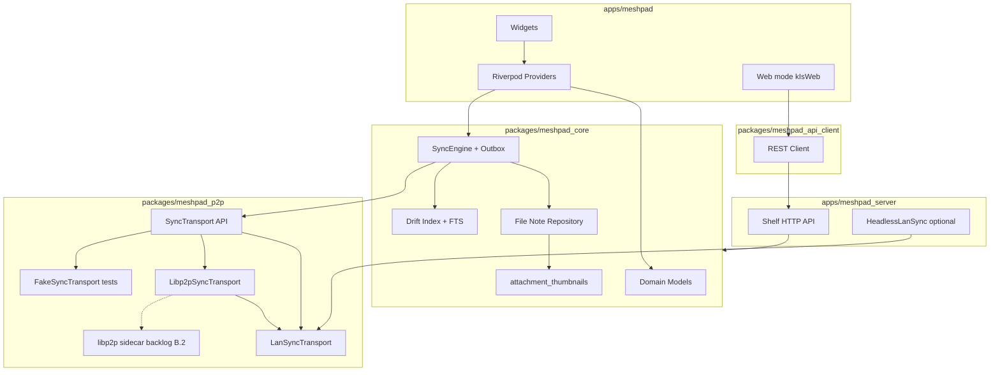

# Архитектура MeshPad

Документ описывает **фактическую** архитектуру MeshPad **0.2.0** (MVP + post-MVP). При расхождении с ранними черновиками приоритет у кода и [PLAN.md](../PLAN.md) §5–6.

**Production sync:** `LanSyncTransport` (mDNS/UDP/HTTP/HTTPS). libp2p (`Libp2pSyncTransport`) — scaffold с LAN fallback; переключатель в UI скрыт (`MeshPadFeatureFlags.libp2pTransportSettingVisible = false`).

## Слои



## Поток записи заметки (native)

1. UI сохраняет `note.md` + `meta.json` в `notes/<uuid>/`.
2. `NoteRepository` обновляет Drift; для изображений — `ensureImageThumbnail` → `.thumbs/`.
3. `SyncEngine` кладёт запись в `sync_outbox`.
4. `pendingLocalSyncProvider` (debounce ~400 ms) → `SyncController.runSync()`.
5. `LanSyncTransport` отправляет дельту доверенным пирам (HTTPS `:45840` после pairing).

## Поток чтения ленты

1. `NotesListNotifier` читает `listNotesSlice` из Drift (offset/limit).
2. При cold start — `reconcileFromFilesystem()` (FS побеждает).
3. `NoteBubble` + `AttachmentGrid`: превью из `.thumbs/` или inline media players.
4. Web: `RemoteNotesService` → paginated API (`?offset=&limit=`); SSE `/api/events` → debounced reload.

## UI и навигация (реализовано)

| Элемент | Реализация |
|---------|------------|
| Навигация | Только **шапка** (`_FeedHeader`). Sidebar из `ref/` **не используется** |
| Заголовок ленты | Без текста «MeshPad»; «Корзина» — только в режиме корзины |
| Sync | Кнопка в шапке на **всех native**; иконка `Icons.sync` вращается **против часовой** при активном sync; badge = outbox count |
| Sync на карточках | **Нет** (только шапка) |
| Корзина | Иконка в шапке (не FAB) |
| Сортировка | `created_at` / `updated_at`; native → `app_settings.json`, Web → `SharedPreferences` |
| Теги | В `meta.json`; фильтр-чипы в ленте; редактор в меню заметки (не Web) |
| Тема | Тёмная / светлая / системная (`theme_mode`) |
| Язык | ru / en / системный (`locale_mode`, `flutter gen-l10n`) |
| Устройства | PIN-only trust; mDNS + UDP discovery; компактные карточки на телефоне |
| Заметка без текста | «_Пустая заметка_» только если **нет** вложений |
| Видео Windows/Linux/macOS | Постер (кадр на 1/3), tap → диалог; `video_player_win` на Windows |
| Видео Android/iOS | Inline player в ленте |
| Drag-and-drop | Composer: Windows + Linux |

## Границы пакетов

- `meshpad_core` — **без Flutter**; FS, Drift, sync, thumbnails, outbox, export/import.
- `meshpad_p2p` — `SyncTransport`, `LanSyncTransport`, `Libp2pSyncTransport` (LAN fallback), discovery, pairing protocol.
- `meshpad_api_client` — REST для Web.
- `apps/meshpad` — единственное место с `dart:ui` и platform channels.
- `native/meshpad_p2p_sidecar` — Dart HTTP sidecar `:45839` (browse-only mDNS).
- `native/meshpad_p2p_native` — Rust sidecar stub (push/pull pending).

## Web / headless server

`apps/meshpad_server` — тот же `meshpad_core` + Shelf REST.

- Web-клиент: `kIsWeb` → `RemoteNotesService` → API.
- Sync/devices/outbox в Web UI **отключены** (by design).
- Флаг `--p2p`: `HeadlessLanSyncService` — LAN sync + `onRemoteTrusted` для PIN-pairing с desktop.

### HTTP API

| Метод | Путь | Назначение |
|-------|------|------------|
| GET | `/api/health` | `{ "status": "ok", "auth": "none"|"api_key" }` — без ключа |
| GET | `/api/notes` | Список; `?sort=`, `?offset=`, `?limit=` (пагинация) |
| GET | `/api/notes/count` | `{ "count": N }` |
| GET | `/api/notes/<id>` | Полная заметка |
| POST | `/api/notes` | Создать |
| PUT | `/api/notes/<id>` | Обновить |
| PUT | `/api/notes/<id>/attachments/<name>` | Загрузить вложение |
| DELETE | `/api/notes/<id>` | В корзину |
| POST | `/api/notes/<id>/restore` | Восстановить |
| GET | `/api/trash` | Корзина |
| GET | `/api/search?q=` | FTS |
| GET | `/api/events` | SSE: `note_created`, `note_updated`, `note_deleted`, `feed_changed`, … |
| GET | `/api/notes/<id>/attachments/<name>/thumb` | JPEG превью (до 240px, on-demand) |
| GET | `/api/notes/<id>/attachments/<name>` | Файл |

Опционально: `X-MeshPad-Api-Key` на `/api/*` (кроме health).

## LAN sync (production transport)

`LanSyncTransport` на desktop/Android/macOS:

| Компонент | Детали |
|-----------|--------|
| Discovery | mDNS `_meshpad._tcp` + UDP `:45837`; refresh при открытии листа «Устройства» и resume приложения |
| Pairing | HTTP `:45838` `/meshpad/p2p/pairing/*` — **только PIN**; TTL offer; rate-limited confirm |
| Sync data | HTTPS `:45840` (pinned cert) или HTTP `:45838` fallback |
| Auth | Shared secret в `trusted/`; headers `X-MeshPad-Peer-Id`, `X-MeshPad-Auth-Token` на sync endpoints |
| Trust store | `devices/trusted/<peer_id>.json` + LAN endpoint + TLS pin |
| Merge | LWW по `updated_at`; tombstones; purge через 7 дней |
| Outbox ack | После sync: только если peer имеет meta + все вложения (sha256) |
| Attachments | >256 KB: chunked/resumable upload + sha256 verify |
| Maintenance | `purgeExpiredTrash` на auto-sync tick; reconcile → rebuild `.thumbs/` |
| Android background | WorkManager: purge + reconcile + **LAN sync** (мин. 15 мин, Wi‑Fi) |

Wire format: [SYNC_WIRE.md](SYNC_WIRE.md).

### libp2p (Phase B — backlog data plane)

`createSyncTransport(SyncTransportKind)` выбирает `LanSyncTransport` или `Libp2pSyncTransport`. В production всегда **LAN**:

- UI-переключатель скрыт (`feature_flags.dart`).
- Сохранённый `sync_transport: "libp2p"` в `app_settings.json` принудительно мапится на LAN.
- Dev override: `--dart-define=MESHPAD_SYNC_TRANSPORT=libp2p` (всё равно LAN fallback до Rust push/pull).

Sidecar `:45839` — mDNS browse + SSE events; см. [LIBP2P.md](LIBP2P.md).

## Auto-sync (native)

1. **Debounced** — после локальных мутаций (`pendingLocalSyncProvider` → 400 ms).
2. **Periodic** — `SyncLoopController` по интервалу из настроек (15–60 мин).
3. **Android background** — WorkManager: reconcile + purge + LAN sync (мин. 15 мин).
4. **Tray** — «Синхронизировать» в меню.

## Файловая структура данных

```text
<dataDir>/
  notes/<uuid>/
    note.md
    meta.json          # tags[], title, timestamps, attachments meta
    attachments/
    .thumbs/           # JPEG превью изображений (локально)
  devices/
    local_identity.json
    trusted/<peer_id>.json
    tls/               # self-signed cert for HTTPS sync
  app_settings.json
  meshpad.log
```

Drift-индекс пересобирается: старт, «Проверить данные», WorkManager.

## Дальнейшее развитие

Дорожная карта §12 **закрыта**. Бэклог — [PLAN.md §13](../PLAN.md#13-бэклог-вне-текущего-релиза):

1. **B.2** — libp2p push/pull в Rust sidecar; вернуть переключатель transport в настройках.
2. **E.5** — история версий заметок.
3. **E.6** — in-app updates (полноценный installer flow).
