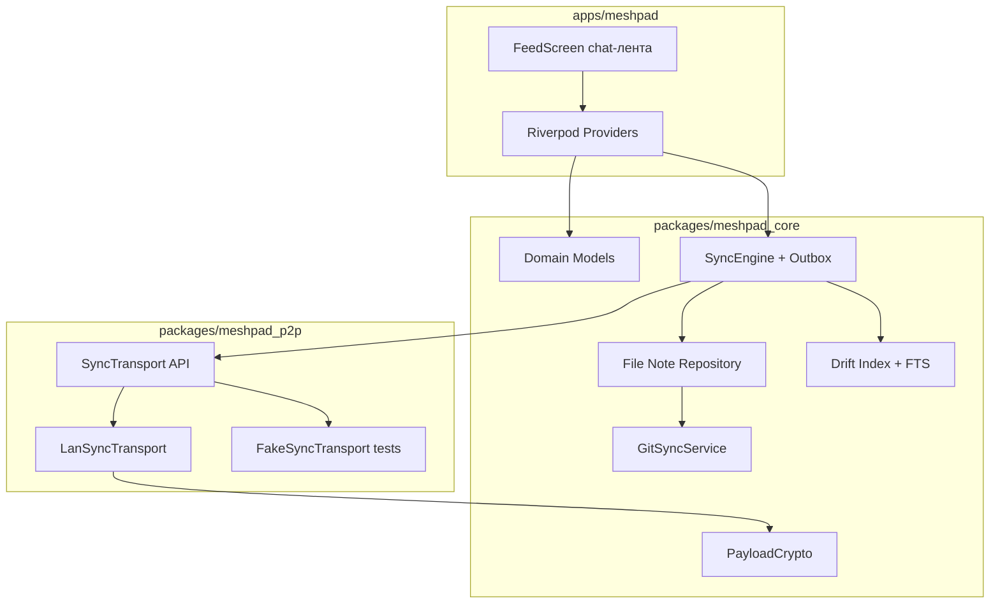

# Архитектура MeshPad

Документ описывает архитектуру MeshPad **1.0** (простота и надёжность). При расхождении с ранними черновиками приоритет у кода и [CHANGELOG.md](../CHANGELOG.md). См. [ADR 0003](ADR/0003-simplicity-lan-git.md).

**Клиентские платформы:** Windows, Android; Linux (Ubuntu) — CI compile без активной разработки. См. [PLATFORMS.md](PLATFORMS.md).

**Production sync:** `LanSyncTransport` (mDNS/UDP/HTTP/HTTPS) с шифрованием payload ключом pairing. **Git sync** — вторичный ручной канал (GitHub, зеркало `notes/<id>/` без вложений).

## Слои

## Поток записи заметки (native)

1. UI сохраняет `note.md` + `meta.json` в `notes/<uuid>/`.
2. `NoteRepository` обновляет Drift; для изображений — thumbnails в `.thumbs/`.
3. `SyncEngine` кладёт запись в `sync_outbox`.
4. Debounce ~400 ms → `SyncController.runSync()`.
5. `LanSyncTransport` отправляет дельту доверенным пирам (зашифрованный payload).

## Multi-peer sync (LAN mesh)

Оркестрация в `LanSyncCoordinator` (`meshpad_p2p`):

| Поведение | Описание |
|-----------|----------|
| Порядок пиров | Online → hub (имя содержит «Hub») → `lastSeenAt` |
| Параллелизм | `normal`: до 2 пиров; `gentle`: 1 |
| Offline-пир | `unreachable` — пропуск без ошибки batch |
| Реальная ошибка | auth 401/403, timeout, partial push → `partial` / `failed` |
| Cascade | После успешного sync — `POST /meshpad/p2p/sync/cascade` |
| Устойчивость | Outbox + periodic auto-sync; спящие устройства догоняют при wake |

Data plane (catalog delta, LWW, attachments) — без изменений; multi-peer только orchestration.

## UI

| Элемент | Реализация |
|---------|------------|
| Формат | **Chat-лента** — заметки как сообщения (`NoteBubble`), composer внизу |
| Навигация | Шапка: sync, устройства, настройки, git pull/push |
| Sync | LAN автоматически в доверенной Wi‑Fi; SSID allowlist (Android) |
| Git | Ручной pull/push; зеркало FS без attachments |

## Границы пакетов

- `meshpad_core` — FS, Drift, sync, `PayloadCrypto`, `GitSyncService` (без Flutter).
- `meshpad_p2p` — `LanSyncTransport`, discovery, pairing.
- `apps/meshpad` — Flutter UI, platform channels (SSID, share intent).

## Вне scope 1.0

- libp2p / Rust FFI — [LIBP2P.md](LIBP2P.md)
- Web-клиент как продукт
- Теги в главном UI (фильтр убран)

## Ссылки

- [SYNC_WIRE.md](SYNC_WIRE.md) — wire format LAN
- [SECURITY.md](SECURITY.md) — threat model
- [GIT_SYNC.md](GIT_SYNC.md) — Git channel
