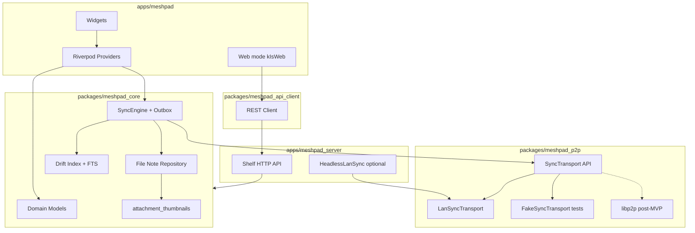

# Архитектура MeshPad

Документ описывает **фактическую** архитектуру MVP 0.1.0. При расхождении с ранними черновиками приоритет у кода и [PLAN.md](../PLAN.md) § «Реализованное MVP».

## Слои



## Поток записи заметки (native)

1. UI сохраняет `note.md` + `meta.json` в `notes/<uuid>/`.
2. `NoteRepository` обновляет Drift; для изображений — `ensureImageThumbnail` → `.thumbs/`.
3. `SyncEngine` кладёт запись в `sync_outbox`.
4. `pendingLocalSyncProvider` (debounce ~400 ms) → `SyncController.runSync()`.
5. `LanSyncTransport` отправляет дельту доверенным пирам.

## Поток чтения ленты

1. `NotesListNotifier` читает `listNotesSlice` из Drift (offset/limit).
2. При cold start — `reconcileFromFilesystem()` (FS побеждает).
3. `NoteBubble` + `AttachmentGrid`: превью из `.thumbs/` или inline media players.
4. Web: `RemoteNotesService` → paginated API (`?offset=&limit=`).

## UI и навигация (реализовано)

| Элемент | Реализация |
|---------|------------|
| Навигация | Только **шапка** (`_FeedHeader`). Sidebar из `ref/` **не используется** |
| Заголовок ленты | Без текста «MeshPad»; «Корзина» — только в режиме корзины |
| Sync | Кнопка в шапке на **всех native**; иконка `Icons.sync` вращается **против часовой** при активном sync; badge = outbox count |
| Sync на карточках | **Нет** (только шапка) |
| Корзина | Иконка в шапке (не FAB) |
| Сортировка | `created_at` / `updated_at`; native → `app_settings.json`, Web → `SharedPreferences` |
| Устройства | PIN-only trust; mDNS + UDP discovery; компактные карточки на телефоне |
| Заметка без текста | «_Пустая заметка_» только если **нет** вложений |
| Видео Windows/Linux | Постер (кадр на 1/3), tap → диалог; `video_player_win` |
| Видео Android/iOS | Inline player в ленте |
| Drag-and-drop | Composer: Windows + Linux |

## Границы пакетов

- `meshpad_core` — **без Flutter**; FS, Drift, sync, thumbnails, outbox.
- `meshpad_p2p` — `SyncTransport`, `LanSyncTransport`, discovery, pairing protocol.
- `meshpad_api_client` — REST для Web.
- `apps/meshpad` — единственное место с `dart:ui` и platform channels.

## Web / headless server

`apps/meshpad_server` — тот же `meshpad_core` + Shelf REST.

- Web-клиент: `kIsWeb` → `RemoteNotesService` → API.
- Sync/devices/outbox в Web UI **отключены** (by design).
- Флаг `--p2p`: `HeadlessLanSyncService` — LAN sync + `onRemoteTrusted` для PIN-pairing с desktop.

### HTTP API

| Метод | Путь | Назначение |
|-------|------|------------|
| GET | `/api/health` | `{ "status": "ok" }` |
| GET | `/api/notes` | Список; `?sort=`, `?offset=`, `?limit=` (пагинация) |
| GET | `/api/notes/count` | `{ "count": N }` |
| GET | `/api/notes/<id>` | Полная заметка |
| POST | `/api/notes` | Создать |
| PUT | `/api/notes/<id>` | Обновить |
| PUT | `/api/notes/<id>/attachments/<name>` | Загрузить вложение |
| DELETE | `/api/notes/<id>` | В корзину |
| POST | `/api/notes/<id>/restore` | Восстановить |
| GET | `/api/trash` | Корзина |
| GET | `/api/search?q=` | FTS |
| GET | `/api/notes/<id>/attachments/<name>` | Файл |

## LAN sync (MVP transport)

`LanSyncTransport` на desktop/Android:

| Компонент | Детали |
|-----------|--------|
| Discovery | mDNS `_meshpad._tcp` + UDP `:45837` |
| Sync | HTTP `/meshpad/p2p/*` — каталог, push/pull, вложения |
| Pairing | PIN over HTTP (**только PIN**); TTL offer; rate-limited confirm |
| Auth | Shared secret в `trusted/`; headers `X-MeshPad-Peer-Id`, `X-MeshPad-Auth-Token` на sync endpoints |
| Trust store | `devices/trusted/<peer_id>.json` + LAN endpoint |
| Merge | LWW по `updated_at`; tombstones; purge через 7 дней |
| Maintenance | `purgeExpiredTrash` на auto-sync tick; reconcile → rebuild `.thumbs/` |

**Post-MVP:** native libp2p, TLS/Noise. Auth token на sync endpoints — **реализовано** (Phase A.1).

## Auto-sync (native)

1. **Debounced** — после локальных мутаций (`pendingLocalSyncProvider` → 400 ms).
2. **Periodic** — `SyncLoopController` по интервалу из настроек (15–60 мин).
3. **Android background** — WorkManager: reconcile + purge (мин. 15 мин).
4. **Tray** — «Синхронизировать» в меню.

## Файловая структура данных

```text
<dataDir>/
  notes/<uuid>/
    note.md
    meta.json
    attachments/
    .thumbs/          # JPEG превью изображений (генерируется локально)
  devices/
    local_identity.json
    trusted/<peer_id>.json
```

Drift-индекс пересобирается: старт, «Проверить данные», WorkManager.

## Post-MVP (архитектурные изменения)

См. [PLAN.md § Post-MVP](../PLAN.md#16-post-mvp--план-развития).

Кратко:

1. **libp2p native crate** — замена LAN HTTP, тот же `SyncTransport` API.
2. **Sync auth** — shared secret / token в `trusted/` для HTTP endpoints (**реализовано**).
3. **Web push** — WebSocket или SSE для обновления ленты без polling.
4. **Resume upload** — chunked transfer больших вложений по sha256.
