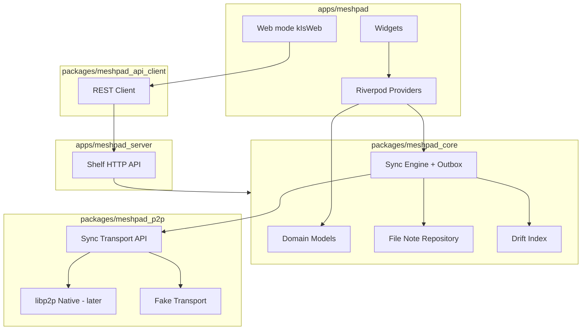

# Архитектура MeshPad

## Слои

## Поток записи заметки

1. UI сохраняет `note.md` + `meta.json` в `notes/<uuid>/`.
2. `NoteRepository` обновляет Drift.
3. `SyncEngine` кладёт запись в `sync_outbox`.
4. `SyncTransport` отправляет дельту доверенным пирам (или откладывает).

## Поток чтения ленты

1. UI запрашивает список у `NotesListNotifier`.
2. Notifier читает из Drift (быстро), при cold start — reconcile с FS.
3. Карточки строятся из `NoteSummary` + путь к превью вложений.

## Границы пакетов

- `meshpad_core` **не зависит** от Flutter.
- `meshpad_p2p` зависит только от `meshpad_core` (модели событий).
- `apps/meshpad` — единственное место с `dart:ui` и platform channels.

## Web / Linux server

Headless-процесс `apps/meshpad_server`:

- тот же `meshpad_core` + REST API на Shelf;
- Web-клиент (Flutter web) ходит в API; P2P остаётся на сервере (позже).

### HTTP API (MVP)

| Метод | Путь | Ответ |
|-------|------|-------|
| GET | `/api/health` | `{ "status": "ok" }` |
| GET | `/api/notes` | массив `{ id, title, author, created_at, preview, … }` |
| GET | `/api/notes/<id>` | полная заметка + вложения |
| POST | `/api/notes` | создать заметку (JSON body) |
| PUT | `/api/notes/<id>` | обновить заметку |
| DELETE | `/api/notes/<id>` | в корзину |
| POST | `/api/notes/<id>/restore` | восстановить |
| GET | `/api/trash` | корзина |
| GET | `/api/search?q=` | FTS-поиск |
| GET | `/api/notes/<id>/attachments/<name>` | файл вложения |

Запуск: `.\scripts\run-server.ps1` (порт 8787 по умолчанию).
