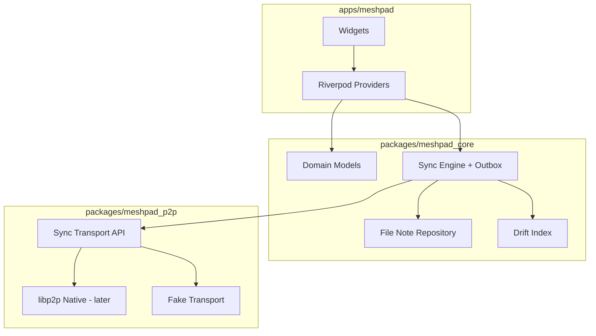

# Архитектура MeshPad

## Слои

## Поток записи заметки

1. UI сохраняет `note.md` + `meta.json` в `notes/<uuid>/`.
2. `NoteRepository` обновляет Drift.
3. `SyncEngine` кладёт запись в `sync_outbox`.
4. `SyncTransport` отправляет дельту доверенным пирам (или откладывает).

## Поток чтения ленты

1. UI запрашивает список у `NotesListNotifier`.
2. Notifier читает из Drift (быстро), при cold start — reconcile с FS.
3. Карточки строятся из `NoteSummary` + путь к превью вложений.

## Границы пакетов

- `meshpad_core` **не зависит** от Flutter.
- `meshpad_p2p` зависит только от `meshpad_core` (модели событий).
- `apps/meshpad` — единственное место с `dart:ui` и platform channels.

## Web / Linux server

Headless-процесс на Linux:

- тот же `meshpad_core` + HTTP API;
- Web-клиент (Flutter web) ходит в API, P2P остаётся на сервере.

Детали API — отдельная спецификация после MVP desktop/mobile.
