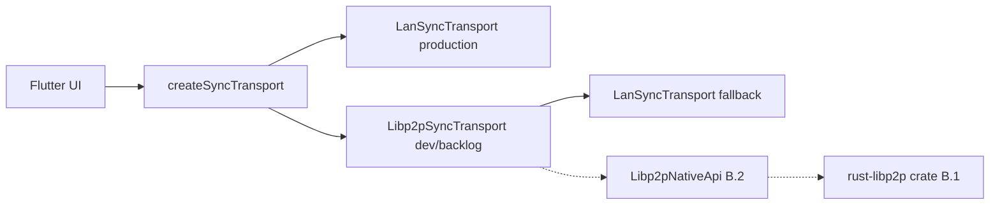

# libp2p transport (Phase B)

MeshPad keeps a narrow [`SyncTransport`](../packages/meshpad_p2p/lib/src/sync_transport.dart) API. Phase B replaces the interim LAN HTTP/mDNS stack with native libp2p while preserving UI and `SyncEngine` behavior.

**As of 0.2.0:** production clients use **LAN only**. libp2p code exists as scaffold; the settings toggle is hidden until Rust push/pull ships.

## Current state

| Task | Status |
|------|--------|
| B.1 Native crate API contract | ✅ documented; Rust scaffold in `native/meshpad_p2p_native/` |
| B.2 FFI bridge | ✅ HTTP sidecar + mDNS discovery SSE; Rust stub | **push/pull pending** |
| B.3 Feature flag / factory | ✅ `SyncTransportKind`, `createSyncTransport`, `Libp2pSyncTransport` (LAN fallback) |
| B.4 Noise/TLS | ✅ LAN HTTPS + cert pinning (`lan_tls_identity.dart`) on `:45840` |

## Selection (production vs dev)

| Режим | Поведение |
|-------|-----------|
| **Production (default)** | `LanSyncTransport`; `sync_transport: "lan"` in `app_settings.json` |
| **Saved `"libp2p"`** | Forced to LAN at runtime while UI flag is off |
| **Settings UI** | Transport toggle **hidden** — `MeshPadFeatureFlags.libp2pTransportSettingVisible = false` in `apps/meshpad/lib/core/constants/feature_flags.dart` |
| **Dev override** | `--dart-define=MESHPAD_SYNC_TRANSPORT=libp2p` — still LAN fallback until Rust implements sync |

When B.2 is ready:

1. Implement push/pull in `native/meshpad_p2p_native/`.
2. Set `libp2pTransportSettingVisible = true`.
3. Optionally migrate persisted `"libp2p"` settings (today: runtime remap only).

## Dart ↔ native contract

```dart
abstract class Libp2pNativeApi {
  Future<void> start({required String peerId, required String displayName});
  Future<void> stop();
  Stream<Libp2pNativeEvent> get events;
  Future<void> requestSync({String? peerId});
}
```

Native events map to existing `SyncTransportEvent` (`PeerDiscovered`, `SyncCompleted`, `SyncFailed`).

## Native crate (B.1)

Planned Rust surface (see `native/meshpad_p2p_native/README.md`):

- `start` / `stop` — lifecycle
- `discover` — peer announcements (mDNS + optional relay later)
- `pair` — PIN over encrypted channel (replaces HTTP `/pairing/*`)
- `push` / `pull` — sync batches compatible with current codec ([SYNC_WIRE.md](SYNC_WIRE.md))

Security layers:

- **Transport (today):** TLS on LAN port `45840` with SHA-256 cert pinning in `trusted/*.json` (B.4)
- **Transport (planned):** libp2p Noise when Rust backend lands
- **App:** auth token in `trusted/<peer_id>.json` (Phase A)

## Migration path



When B.2 lands, `Libp2pSyncTransport.start()` connects to the localhost sidecar (`HttpLibp2pNativeApi`, default `http://127.0.0.1:45839`). The Dart sidecar runs **mDNS browse-only** and emits `peer_discovered` SSE events with `lan_host` / `http_port` / `tls_port`. Until Rust implements push/pull, `requestSync()` pings the sidecar then runs **LAN fallback**; merged LAN + sidecar event streams are exposed when the sidecar is connected.

Run sidecar stub:

```bash
dart run meshpad_p2p_sidecar
# or
cargo run -p meshpad_p2p_native
```

See [native/meshpad_p2p_sidecar/README.md](../native/meshpad_p2p_sidecar/README.md).

## Testing

CI continues to use `FakeSyncTransport` in widget tests. Unit tests cover `createSyncTransport` and `Libp2pSyncTransport` delegation without Rust. `cargo check` runs in CI for the Rust crate.

## Backlog

Full libp2p data plane — [PLAN.md §11](../PLAN.md#11-дорожная-карта--задачи) волна 8 (задачи 8.x).

